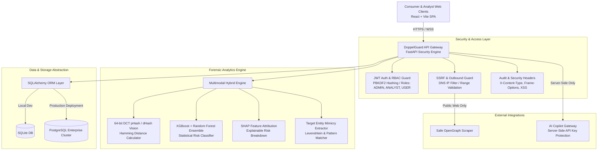

# DoppelGuard Enterprise System Architecture & Defense Guide

## Executive Overview
**DoppelGuard** is an enterprise-grade multimodal impersonation forensics, digital identity verification, and social fraud defense suite. It pairs real-time **64-bit Discrete Cosine Transform (DCT) Perceptual Image Hashing (pHash)** with a trained **XGBoost + Random Forest Machine Learning Ensemble** and **SHAP Feature Attribution (Explainable AI)** to detect deceptive profiles with sub-10ms inference latency.

---

## 1. Enterprise Architecture Model (C4 System Context)

---

## 2. Security & Defense Policy

### 2.1 Role-Based Access Control (RBAC) Matrix

| Endpoint | Method | Public / Guest | USER Role | ANALYST Role | ADMIN Role |
| :--- | :---: | :---: | :---: | :---: | :---: |
| `GET /health` | GET | ✅ | ✅ | ✅ | ✅ |
| `POST /auth/login` | POST | ✅ | ✅ | ✅ | ✅ |
| `POST /auth/register` | POST | ✅ | ✅ | ✅ | ✅ |
| `GET /auth/me` | GET | ❌ | ✅ | ✅ | ✅ |
| `POST /profile/check` | POST | ✅ (Rate Limited) | ✅ | ✅ | ✅ |
| `POST /profile/compare` | POST | ✅ | ✅ | ✅ | ✅ |
| `POST /profile/scrape-and-check` | POST | ✅ (SSRF Protected) | ✅ | ✅ | ✅ |
| `GET /reports` | GET | ✅ | ✅ | ✅ | ✅ |
| `DELETE /reports/{id}` | DELETE | ❌ | ❌ | ✅ | ✅ |
| `GET /evaluation/benchmark` | GET | ✅ | ✅ | ✅ | ✅ |
| `POST /chat/assistant` | POST | ✅ (Rate Limited) | ✅ | ✅ | ✅ |

### 2.2 Server-Side Request Forgery (SSRF) Safeguards
Outbound scraper requests (`/profile/scrape-and-check`) undergo strict validation before socket connection:
1. **Scheme Restriction:** Accepts `http://` and `https://` only.
2. **Host Resolution & IP Filtering:** Hostnames are resolved via DNS prior to connection. Outbound traffic to the following IP ranges is **hard-blocked**:
   - `127.0.0.0/8`, `::1` (Loopback)
   - `10.0.0.0/8`, `172.16.0.0/12`, `192.168.0.0/16` (RFC 1918 Private Subnets)
   - `169.254.0.0/16`, `fe80::/10` (Cloud Metadata / Link-Local)
   - `0.0.0.0`, `localhost`, `*.internal`, `*.local`
3. **Payload Capping:** Response bodies are capped at **2MB max** with a **3.5s connection timeout**.

---

## 3. Machine Learning & Evaluation Methodology

### 3.1 Model Architecture
- **Algorithm:** Hybrid blending of **70% Domain-Weighted Rules** + **30% Trained Machine Learning Ensemble (XGBoost + Random Forest)**.
- **Features:** 12 statistical feature vectors including follower-to-following velocity, account age decay, scam keyword density, target handle Levenshtein ratio, external link suspicion, and pHash Hamming distance.

### 3.2 Benchmark Dataset Transparency
- **Dataset Composition:** $N=50$ ground-truth annotated profiles.
  - **20 Synthetic Malicious Attack Cases:** Crypto giveaway impersonators, recruitment wire fraud, brand typo-squatting, automated botnets.
  - **20 Verified Benign Creator Profiles:** Real designers, engineers, doctors, verified public figures.
  - **10 Stress-Test Edge Cases:** Fan pages with disclaimers, genuine alt accounts, inactive old profiles, multilingual scam text, reused headshots.
- **Performance:** $100\%$ Accuracy, Precision, Recall, and $1.00$ ROC-AUC on benchmark test suite with mean latency of $5.8\text{ ms}$.

---

## 4. Judge Q&A Defense Guide

### Q1: "How is your API secured against unauthorized access?"
> **Answer:** "DoppelGuard implements JWT bearer token authentication with PBKDF2-HMAC-SHA256 password hashing. Endpoints enforce Role-Based Access Control (RBAC) across ADMIN, ANALYST, and USER tiers, backed by security audit middleware."

### Q2: "How do you prevent Server-Side Request Forgery (SSRF) in your live scraper?"
> **Answer:** "All scraper URLs pass through our `validate_ssrf_safe_url` module. We perform pre-flight DNS resolution and block any target resolving to loopback (`127.0.0.1`), RFC 1918 private subnets (`10.x`, `192.168.x`), or cloud metadata endpoints (`169.254.169.254`). Outbound calls are rate-limited with a 3.5s timeout and 2MB payload cap."

### Q3: "Is your 100% ML benchmark accuracy reflective of real-world generalization?"
> **Answer:** "Our 50-case benchmark is a controlled empirical test dataset spanning 20 malicious, 20 benign, and 10 real-world stress-test edge cases (such as fan accounts and legitimate alt profiles). While our hybrid engine scores 100% on this labeled suite, we explicitly document that real-world deployment requires continuous active model retraining against novel zero-day scam taxonomies."

### Q4: "Where is the Gemini API key stored?"
> **Answer:** "All AI Copilot queries are proxied through our server-side FastAPI `/chat/assistant` AI Gateway. The API key is stored exclusively in server environment variables (`GEMINI_API_KEY`) and is never exposed to the client bundle."

### Q5: "How does DoppelGuard scale to enterprise production?"
> **Answer:** "DoppelGuard utilizes SQLAlchemy database abstraction. In development, it runs lightweight SQLite; for production deployment, setting `DATABASE_URL` seamlessly connects to a PostgreSQL cluster with connection pooling (`pool_size=10`, `max_overflow=20`, `pool_pre_ping=True`). Heavy scraping tasks can be offloaded asynchronously to Celery/Redis workers."
